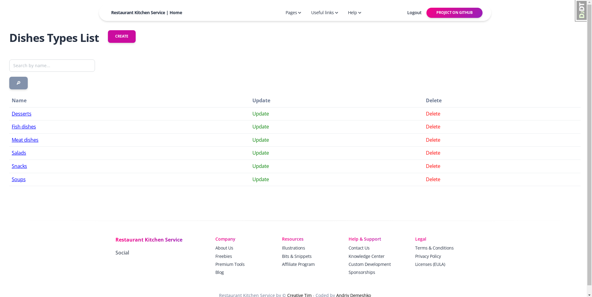

# Restaurant Kitchen Service Project

Restaurant kitchen service Django project to improve interaction between cooks and create new dishes and dishes types

## Check it out!

[Restaurant Kitchen Service project deployed to Render](paste link here)

## Installation

Python3 must be already installed

```shell
git clone https://github.com/andriy-demeshko/restaurant-kitchen-service
cd restaurant_kitchen_service
python -m venv venv
venv\Scripts\activate
pip install -r requirements.txt
python manage.py runserver  # starts Django server
```

## Features

* Authentication functionality for Cook/User
* Managing cooks & dishes directly from website interface
* Powerful admin panel for advanced managing

## DB Structure


## Page examples

Login page


Registration page


Home page


Dishes types list page


Dishes list page


Cooks list page


Dishes types details page


Dishes details page


Cooks details page
